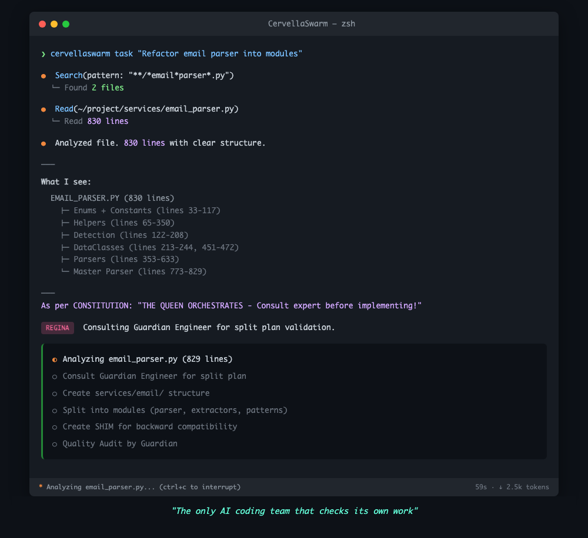

# CervellaSwarm

> **16 AI Agents. 1 Command. Your AI Development Team.**

<p align="center">
  
</p>

<p align="center">
  <em>Regina coordinates, Workers execute, Guardians verify. The only AI coding team that checks its own work.</em>
</p>

A multi-agent orchestration system for Claude Code. Instead of one AI assistant, get a team of 16 specialized AI agents working together on your codebase.

## What Problem Does This Solve?

Single AI assistants forget context, lack specialization, and can't divide work. CervellaSwarm gives you:

- **Specialized Agents** - Frontend, Backend, Testing, Security, DevOps experts
- **Persistent Memory** - SNCP system remembers across sessions
- **Parallel Work** - Multiple agents working simultaneously
- **Quality Gates** - Guardian agents review before merge

## Quick Start

```bash
# 1. Install globally
npm install -g cervellaswarm

# 2. Initialize in your project
cervellaswarm init

# 3. Give tasks to your AI team
cervellaswarm task "add login page"         # Auto-routes to frontend
cervellaswarm task "create REST API"        # Auto-routes to backend
cervellaswarm task "find security issues"   # Auto-routes to security
```


## The Team (16 Agents)

| Role | Agent | Specialty |
|------|-------|-----------|
| **Queen** | cervella-orchestrator | Coordinates all agents |
| **Guardian** | cervella-guardiana-qualita | Code quality review |
| **Guardian** | cervella-guardiana-ops | DevOps & infrastructure |
| **Guardian** | cervella-guardiana-ricerca | Research validation |
| **Worker** | cervella-frontend | React, CSS, UI/UX |
| **Worker** | cervella-backend | Python, FastAPI, APIs |
| **Worker** | cervella-tester | Testing, QA, debugging |
| **Worker** | cervella-data | SQL, analytics, databases |
| **Worker** | cervella-security | Security audits |
| **Worker** | cervella-devops | Deploy, CI/CD, Docker |
| **Worker** | cervella-researcher | Technical research |
| **Worker** | cervella-docs | Documentation |
| **Worker** | cervella-marketing | UX strategy, copy |
| **Worker** | cervella-ingegnera | Architecture, refactoring |
| **Worker** | cervella-scienziata | Market research, trends |
| **Worker** | cervella-reviewer | Code review |

## Key Features

**SNCP - Persistent Memory**
```
Your AI team remembers everything:
- Project state across sessions
- Decisions and their reasoning
- Research findings
- Roadmaps and progress
```

**Automatic Hooks**
```
Quality gates built-in:
- Pre-session: Load context automatically
- Post-session: Verify consistency
- File limits: Prevent accumulation
```

**Parallel Execution**
```
Multiple agents working together:
- Frontend + Backend simultaneously
- Guardian reviews completed work
- Queen orchestrates the flow
```

## Use Cases

**1. Complex Feature Development**
```bash
cervellaswarm task "Build user authentication with OAuth"
# Regina coordinates frontend + backend + tester automatically
```

**2. Code Review & Refactoring**
```bash
cervellaswarm task "Review the authentication module" -a reviewer
# Reviewer analyzes code and suggests improvements
```

**3. Research Before Implementation**
```bash
cervellaswarm task "How do enterprise apps handle rate limiting?" -a researcher
# Researcher investigates best practices before you code
```

## Requirements

- macOS or Linux
- Claude Code CLI installed
- Claude API key (Pro subscription recommended)

## Documentation

| Doc | Description |
|-----|-------------|
| [Getting Started](docs/GETTING_STARTED.md) | Full setup tutorial |
| [Agents Reference](docs/AGENTS_REFERENCE.md) | All 16 agents detailed |
| [SNCP Guide](docs/SNCP_GUIDE.md) | Memory system explained |
| [Architecture](docs/ARCHITECTURE.md) | How it all works |

## Project Status

```
PHASE 1: Foundation     [##########] 100%
PHASE 2: MVP            [##########] 100%
PHASE 3: Alpha Users    [##........] 20%
PHASE 4: Scale          [..........] 0%
```

CLI and MCP Server live on npm. Public launch January 2026.

## Philosophy

> **"The only AI coding team that checks its own work"**

We're honest about our limitations. AI tools today aren't perfect - context gets lost, code quality varies, mistakes happen.

Our solution? **Built-in quality guardians.** Three dedicated agents whose only job is to review and verify the work of other agents. Like having senior developers on every PR, but AI.

> "Sometimes it feels like magic." - That's our promise. Not always, but when it works... it really works.

**Our values:**
- "Fatto BENE > Fatto VELOCE" (Done RIGHT > Done FAST)
- Honest about limitations
- Quality over speed
- Growing with the community

## Contributing

Interested in contributing? See [CONTRIBUTING.md](CONTRIBUTING.md) (coming soon).

## Support

- Issues: [GitHub Issues](https://github.com/rafapra3008/CervellaSwarm/issues)
- Discussions: Coming soon

## License

Copyright 2026 Rafa & Cervella

Licensed under the Apache License, Version 2.0 (the "License");
you may not use this file except in compliance with the License.
You may obtain a copy of the License at

    http://www.apache.org/licenses/LICENSE-2.0

Unless required by applicable law or agreed to in writing, software
distributed under the License is distributed on an "AS IS" BASIS,
WITHOUT WARRANTIES OR CONDITIONS OF ANY KIND, either express or implied.
See the License for the specific language governing permissions and
limitations under the License.

See [LICENSE](LICENSE) for full text.

---

**CervellaSwarm** - Built with love by Cervella & Rafa

*"16 brains are better than one."*
